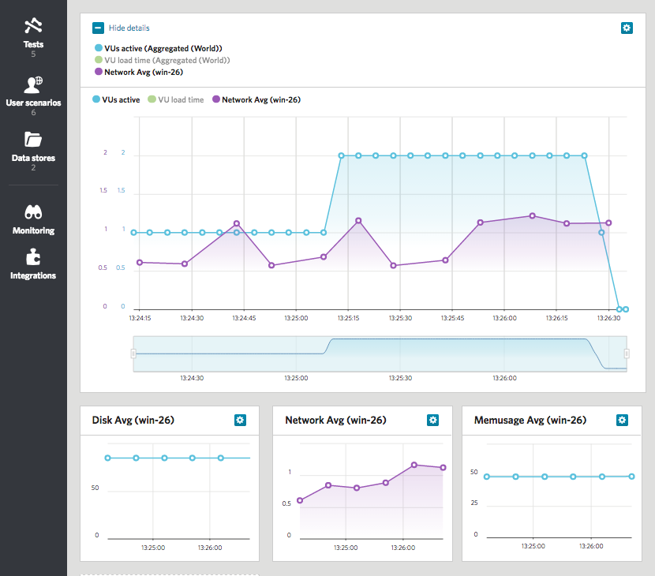

Load Impact Server Metrics Agent
================================
The Load Impact Server Metrics Agent is a software you install on your server that will measure metrics and report them to Load Impact while running a load test at loadimpact.com. It currently supports Linux (Ubuntu, Centos) and Windows, you can quickly download and install provided OS package or build it from source files. The agent is Nagios compatible and can read the performance data output of standard or custom Nagios plugins for extended functionality. By default it will report CPU, memory, bandwidth and disk usage.

Quick links
-----------

- [Load Impact](https://loadimpact.com)
- [Installation](readme/1-INSTALL.md)
- [Configuration](readme/2-CONFIGURE.md)
- [Building from source](readme/1b-BUILD.md)
- [Running tests](readme/3-RUN.md)
- [Windows installer](https://s3.amazonaws.com/loadimpact/server-metrics-agent/server-metrics-agent-1.1-win.amd64.exe)
- [Tar](https://s3.amazonaws.com/loadimpact/server-metrics-agent/li-metrics-agent_1.1.tar.gz)
- [Tutorial article](http://support.loadimpact.com/knowledgebase/articles/265482-server-monitoring-formerly-server-metric-agents)
- [Changelog](CHANGELOG.md)
- [Apache License v2.0](LICENSE)

Usage
-----

- Register Load Impact account
- [Install](readme/1-INSTALL.md) Loadimpact Server Metrics Agent as a service on your server
- [Configure](readme/2-CONFIGURE.md) Server Metrics Agent and attach it to Load Impact test
- [Run](readme/3-RUN.md) load tests and collect metrics!

Copyright and license
---------------------

Copyright 2012-2016 Load Impact AB

Licensed under the Apache License, Version 2.0 (the "License");
you may not use this work except in compliance with the License.
You may obtain a copy of the License in the LICENSE file, or at:

   http://www.apache.org/licenses/LICENSE-2.0

Unless required by applicable law or agreed to in writing, software
distributed under the License is distributed on an "AS IS" BASIS,
WITHOUT WARRANTIES OR CONDITIONS OF ANY KIND, either express or implied.
See the License for the specific language governing permissions and
limitations under the License.
