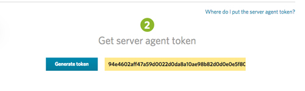

Installation 
============


Gettting Load Impact SMA token
------------------------------

- Login Load Impact Account
- Click "Monitoring" menu item, then "Setup" button and then choose "Load Impact Server Agent" (alternatively you can go to [https://app.loadimpact.com/server-agents/load-impact](https://app.loadimpact.com/server-agents/load-impact) page)
- Scroll to step 2, then copy token or generate and copy new one

Use the same token for all agents/machines you wish to monitor. You can re-generate a new token at any time if you believe it has been compromised or distributed to someone outside your company. If you do re-generate a token, the old token will no longer be valid.



Installing packages
---------------------

Load Impact distributed `.deb` and `.rpm` packages for Linux systems and Windows installation package.
If you want to install Server Metrics Agent from source see [building section](1b-BUILD.md).

Linux packages are distributed by the [packagecloud.io](https://packagecloud.io/loadimpact/server-metrics-agent) service.

Linux installation requires Python `v2.6` or `v2.7` installed on your server. 

### Ubuntu

Install `psutil` dependency (skip this step if `psutil` has been already installed)
```
sudo apt-get install python-psutil
```

Packagecloud.io provides setup script that manages `.deb` package installation included `https-transport`setup, setting PGP verification keys and system `.list` file. You can see details [here](https://packagecloud.io/loadimpact/server-metrics-agent/install). So quick way is to download and run this script. Alternatively you can run commands manually folowing [instructions](https://packagecloud.io/loadimpact/server-metrics-agent/install) on `manual` tab.
```
wget https://packagecloud.io/install/repositories/loadimpact/server-metrics-agent/script.deb.sh
sudo bash script.deb.sh
```

Install last version of the package
```
sudo apt-get install li-metrics-agent
```

Run configuration dialog. You will be asked to give the agent a name and your server metrics token. The name is only for identification in the Load Impact application. It is recomended to choose short readable name. Name and token will be written in `config-file`. You can read about advanced configuration [here](ADVANCED.md)

````
sudo li-metrics-agent-config
````

Output like `li_metrics_agent start/running, process XXXX` means that agent installed as a service and started. It will automaticly restarted after a crash or server reboot.

You can also press 'Check installation' button on `https://app.loadimpact.com/server-agents/load-impact` page. If new entry comes to `Monitoring tools` list then agent is succefully installed.


If something goes wrong it's worth to check `.log` file:
```
tail /var/log/li_metrics_agent.log
```

You can manage it a usual linux service
```
# Upstart systems (Ubuntu 12.04, Ubuntu 14.04)
sudo initctl status|stop|start|restart li_metrics_agent

# Systemd systems (Ubuntu 16.04)
sudo systemctl status|stop|start|restart li_metrics_agent.service
```

Next see [configuration section](2-CONFIGURE.md) for advanced agent configuration and [running section](3-RUN.md) for make test powered by agent running.


### Centos

Install `psutil` dependency (skip this step if `psutil` has been already installed)
```
sudo yum install epel-release
sudo yum install python-psutil
```

Packagecloud.io provides setup script that manages `.rpm` package installation included `https-transport`setup, setting PGP verification keys and system `.list` file. You can see details [here](https://packagecloud.io/loadimpact/server-metrics-agent/install). So quick way is to download and run this script. Alternatively you can run commands manually folowing [instructions](https://packagecloud.io/loadimpact/server-metrics-agent/install) on `manual` tab.
```
wget https://packagecloud.io/install/repositories/loadimpact/server-metrics-agent/script.rpm.sh
sudo bash script.rpm.sh
```

Install last version of the package
```
sudo yum install li-metrics-agent
```

Run configuration dialog. You will be asked to give the agent a name and your server metrics token. The name is only for identification in the Load Impact application. It is recomended to choose short readable name. Name and token will be written in `config-file`. You can read about advanced configuration [here](ADVANCED.md)

````
sudo li-metrics-agent-config
````

You can also press 'Check installation' button on `https://app.loadimpact.com/server-agents/load-impact` page. If new entry comes to `Monitoring tools` list then agent is succefully installed.


If something goes wrong it's worth to check `.log` file:
```
tail /var/log/li_metrics_agent.log
```

You can manage it a usual linux service
```
# Upstart systems (Centos 6)
sudo initctl status|stop|start|restart li_metrics_agent

# Systemd systems (Centos 7)
sudo systemctl status|stop|start|restart li_metrics_agent.service
```

Next see [configuration section](2-CONFIGURE.md) for advanced agent configuration and [running section](3-RUN.md) for make test powered by agent running.


### Windows
If you have the installer, run it and the server metrics agent will install itself as a service. During the installation you will be asked to give the server metrics agent a name and also to provide your server metrics token. The server metrics token can be generated/found on your [https://app.loadimpact.com/server-agents/load-impact](https://app.loadimpact.com/server-agents/load-impact)

Next see [configuration section](2-CONFIGURE.md) for advanced agent configuration and [running section](3-RUN.md) for make test powered by agent running.


