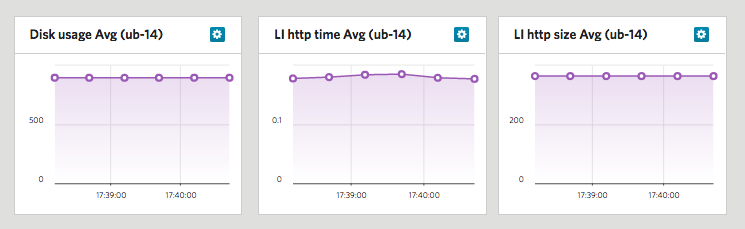

Configuring
===========

Note: In this article we'll be using Ubuntu 14.04, you can do similar steps working with others linux distribution.

Configure custom metrics using psutil
-------------------------------------

Lets create custom metric using `psutil.virtual_memory()`. First try it in console to see output:
```
python
>>> import psuitl;
>>> psutil.virtual_memory()
vmem(total=1040695296L, available=972890112L, percent=6.5, used=351432704L, free=689262592L, active=261943296, inactive=47529984, buffers=11210752L, cached=272416768)

>>> mem = psutil.virtual_memory().active/1024/1024;
>>> print "Memory active %sMB |MemActive=%sMB;" % (mem,mem)
Memory active 249MB |MemActive=249MB;
```

Assuming we want to have active memory in MB, we can write a python command:

```
python -c 'import psutil; mem = psutil.virtual_memory().active/1024/1024; print "Memory active %sMB |MemActive=%sMB;" % (mem,mem)'
Memory active 249MB |MemActive=249MB;
```
The output of a command is valid nagios plugin output that is readable for agent. Here `MemActive` is label, `249` is a value and `MB` is a unit. 

Let's update agents `config-file`:
```
sudo vi /usr/lib/li_metrics_agent/li_metrics_agent.conf

# li_metrics_agent.conf
[test5]
command = python -c 'import psutil; mem = psutil.virtual_memory().active; print "Memory active %sB |MemActive=%sB;" % (mem,mem)'
```
Restart agent
```
sudo initctl restart li_metrics_agent
```

Run load test and add new metrics to the test result page! 
See [running section](3-RUN.md) for make test powered by agent running.

Note: instead of providing a single command we can creat a python script and add a path to the command option.
We'll demonstrate that approach in the next section.

Configure custom metrics using Nagios plugins
---------------------------------------------

Let's add standart Nagios plugin to Server Metrics Agent installed on your server.

First install nagios plugins on your server

```
sudo apt-get install nagios-plugins 
```

Select plugin you want to add, here we use `check_disk`. Let's where it was installed and then run `check-disk` to see possible options:
```
$ find / -type f -name 'check_disk'
/usr/lib/nagios/plugins/check_disk

$ /usr/lib/nagios/plugins/check_disk --help
... lots of output
Examples:
 check_disk -w 10% -c 5% -p /tmp -p /var -C -w 100000 -c 50000 -p /
    Checks /tmp and /var at 10% and 5%, and / at 100MB and 50MB
 check_disk -w 100 -c 50 -C -w 1000 -c 500 -g sidDATA -r '^/oracle/SID/data.*$'
    Checks all filesystems not matching -r at 100M and 50M. The fs matching the -r regex
    are grouped which means the freespace thresholds are applied to all disks together
 check_disk -w 100 -c 50 -C -w 1000 -c 500 -p /foo -C -w 5% -c 3% -p /bar
    Checks /foo for 1000M/500M and /bar for 5/3%. All remaining volumes use 100M/50M

$ /usr/lib/nagios/plugins/check_http --help
... lots of output
Examples:
 CHECK CONTENT: check_http -w 5 -c 10 --ssl -H www.verisign.com

```

Let's run commands we need so we can see output format:
```
$ /usr/lib/nagios/plugins/check_disk -w 10% -c 5% -p /
DISK OK - free space: / 6603 MB (88% inode=88%);| /=896MB;7131;7527;0;7924

$ /usr/lib/nagios/plugins/check_http -H --ssl loadimpact.com
HTTP OK: HTTP/1.1 301 Moved Permanently - 364 bytes in 0.186 second response time |time=0.186482s;;;0.000000 size=364B;;;0
```
The output of a command is valid nagios plugin output that is readable for agent. Here `time` and `size` are labels, `s` and `B` are units. 

Open agent config file:
```
vi /usr/lib/li_metrics_agent/li_metrics_agent.conf
```

Add command to agent config (we assume we have 4 predefined metrics by default):
```
# /usr/lib/li_metrics_agent/li_metrics_agent.conf
[test5]
command = /usr/lib/nagios/plugins/check_disk -w 10% -c 5% -p /
performance_data = /:MB

[test6]
command = /usr/lib/nagios/plugins/check_http -H --ssl loadimpact.com
performance_data = time:s size:B
```

Restart agent:
```
sudo initctl restart li_metrics_agent
```

Now when you run Load Impact tests you can see new 3 metrics ("/", "time" and "size") appeared.

### Fine tuning: custom metric names

We can use custom metric name using `sed` command. In its simplest form, you can change one name to another name using the following syntax: 
```
sed 's/old_metric_name/new_metric_name/'
```

Let's create custom `disk-metric` command by creating `disk-metric.sh` bash script

```
sudo vi /usr/local/bin/disk-metric.sh
```
and place customized output there:
```bash
#!/bin/bash
/usr/lib/nagios/plugins/check_disk -w 10% -c 5% -p / | sed 's/\/\=/Disk\ usage\=/'
```

```
sudo vi /usr/local/bin/li-http-metric.sh
```

```bash
#!/bin/bash
/usr/lib/nagios/plugins/check_http -H --ssl loadimpact.com | sed 's/time=/LI\ http\ time\=/' | sed 's/size=/LI\ http\ size\=/'  
```


Now change folowing lines in agent config file:
```
[test5]
command = bash disk-metric.sh
performance_data = 'Disk usage':MB

[test6]
command = bash li-http-metric.sh
performance_data = 'LI http time':s 'LI http size':B
```

Restart `li_metrics_agent` service.
```
sudo initctl restart li_metrics_agent
```

Run load test and add new metrics to the test result page! 
See [running section](3-RUN.md) for make test powered by agent running.


