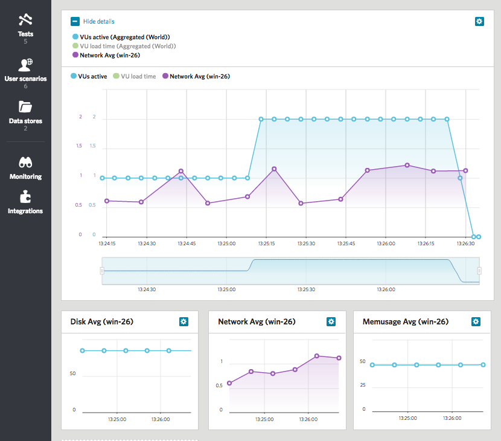

Running
=======

First you should attach installed agent to the test. Go to test configuration page, scroll down to the `Server monitoring` panel and add agent to the test configuration. Then save test config by pressing button on the top of the page.


Now the test is ready to run and collect metrics from attached agent. Press `Run test` button on the top of the page and see test running. You can see something like 

```
Waiting for server agents...
last-u14 agent online 100%
* last-u14 online
```

in the progress panel than agent works fine. While test running and after test finished you can add metrics collected by agent to the dashboard. Four metrcis are collected by default: Network, CPU, Memusage, Disk). If you want to add more see [configuration section](2-CONFIGURE.md).


Now you can see collected metrics on your dashboard.


